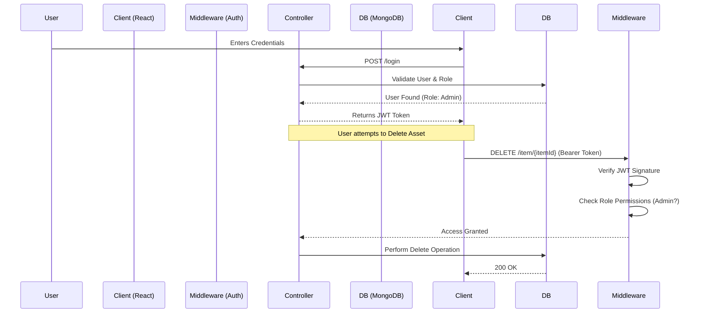
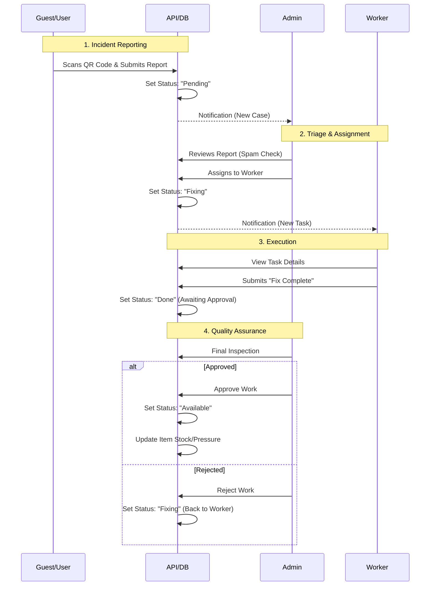

# Enterprise Asset Management System (RBAC)


## 📌 Project Overview
This is an enterprise-grade **Asset Management Platform** designed to track and maintain fire safety equipment across multiple corporate branches. Unlike standard CRUD applications, this system features a complex **Role-Based Access Control (RBAC)** architecture with 6 distinct user roles, ensuring secure data isolation and operational workflow compliance.

**Business Value:** Replaces manual spreadsheet tracking with a centralized, real-time dashboard that ensures fire safety compliance and audit readiness.

## 🚀 Key Features
* **Advanced RBAC (6 Roles):** Granular permission settings for Admin, Manager, Inspector, Technician, Viewer, and Auditor.
* **B2B Multi-Tenancy:** Engineered a hierarchical permission system allowing client companies (Super Members) to self-manage their staff and branches while maintaining strict data isolation from other clients.
* **Guest Reporting Mode:** Allows unauthenticated users (Guests) to scan QR codes on physical assets and submit incident reports without compromising system security.
* **Secure Data Isolation:** Implemented middleware to ensure users can only access data relevant to their specific branch or clearance level.
* **Granular Session Policies:**
    * **High-Privilege Roles (Admin):** Enforced **8-hour hard limit** to reduce the attack surface.
    * **Operational Roles (Worker):** Allowed **24-hour windows** to accommodate long shifts in areas with poor connectivity.
* **Compliance-Ready Audit Logging:** Every critical action (Login, Create User, Delete Asset) is captured in a separate `ActivityLog` collection for safety inspections.

## 🛠 Tech Stack
* **Frontend (Client):** React.js, Tailwind CSS, Axios, Context API
* **Backend (Server):** Node.js, Express.js, RESTful API
* **Database:** MongoDB (Mongoose ODM)
* **Authentication:** JWT (JSON Web Tokens) with Bcrypt password hashing
* **DevOps:** Git, Docker (Optional)

## 📂 System Architecture
The application is decoupled into a Client-Server architecture:
* `/server`: RESTful API handling business logic, authentication, and database connectivity.
* `/client`: React SPA (Single Page Application) for the user interface.

## 🛡 Security Highlights
This system goes beyond standard CRUD by implementing enterprise-grade security policies:

### 1. Middleware Composition
Authentication is handled via composable middleware functions (`authAdmin`, `authWorkerAndAdmin`), ensuring the **Principle of Least Privilege** is enforced at the route level.

### 2. Design Decisions & Trade-offs
* **Why RBAC?** Instead of simple boolean flags (`isAdmin`), I implemented a middleware-based Role System. This allows for future scalability—adding a "Regional Manager" role later requires no rewrite of the auth logic.
* **Security First:** All API endpoints validate the user's `branch_id` against the requested resource to prevent **Insecure Direct Object Reference (IDOR)** attacks.

## 🔄 Workflows & Architecture

### 1. Authentication Flow
The following sequence describes how the RBAC middleware secures the application:



### 2. Maintenance & Incident Lifecycle
How the system handles "Guest" reports and assigns them to field workers:



## 🔧 Getting Started

### Prerequisites
* Node.js (v14 or higher)
* MongoDB Local or Atlas URI

### Installation

**1. Clone the repository**
```bash
git clone [https://github.com/002B/RBAC-Asset-Manager.git](https://github.com/002B/RBAC-Asset-Manager.git)
cd RBAC-Asset-Manager
```

**2. Setup Server (Backend)**
```bash
cd server
npm install
# Create a .env file and add your MONGO_URI and JWT_SECRET
npm start
```

**3. Setup Client (Frontend)**
```bash
cd client
npm install
npm run dev
```

## 🔮 Future Roadmap & Technical Debt
To transition this project from a prototype to a production-ready SaaS, the following architectural improvements are planned:

* **Authentication Strategy Refactor:**
  * *Current State:* Uses a custom sliding-window mechanism (JWT extension via middleware) to maintain user sessions.
  * *Future State:* Implement **Refresh Token Rotation** with a Redis-backed blacklist. This will prevent infinite session extension and allow for immediate token revocation (e.g., if an Admin bans a user).
* **Database Optimization:**
  * Indexing the `client_id` and `role` fields in MongoDB to improve query performance as the dataset grows beyond 10,000 records.
* **Testing Suite:**
  * Add Unit Tests (Jest) for the critical `authMiddleware.js` logic to ensure security regressions are caught early.

## 👤 Author
**Pongsapak Panprasert**
* [LinkedIn](https://www.linkedin.com/in/pongsapak-panprasert)
* [GitHub](https://github.com/002B)